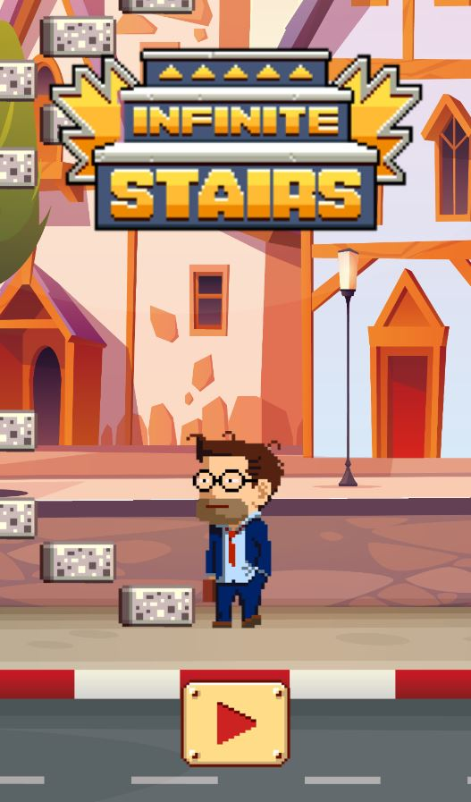
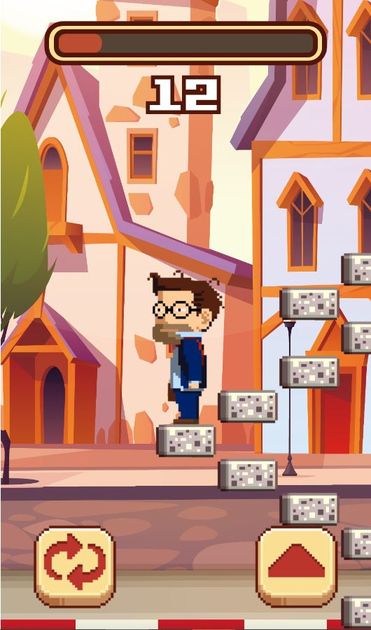
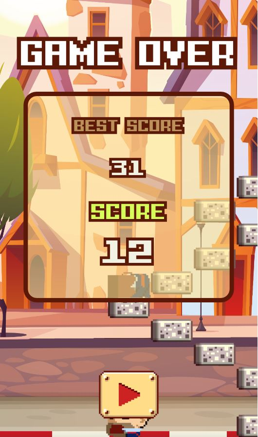
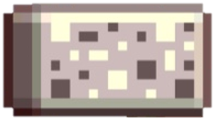
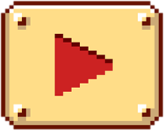
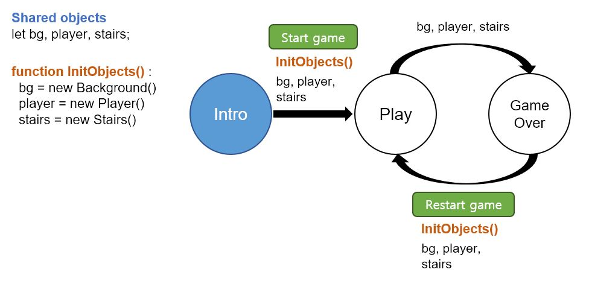
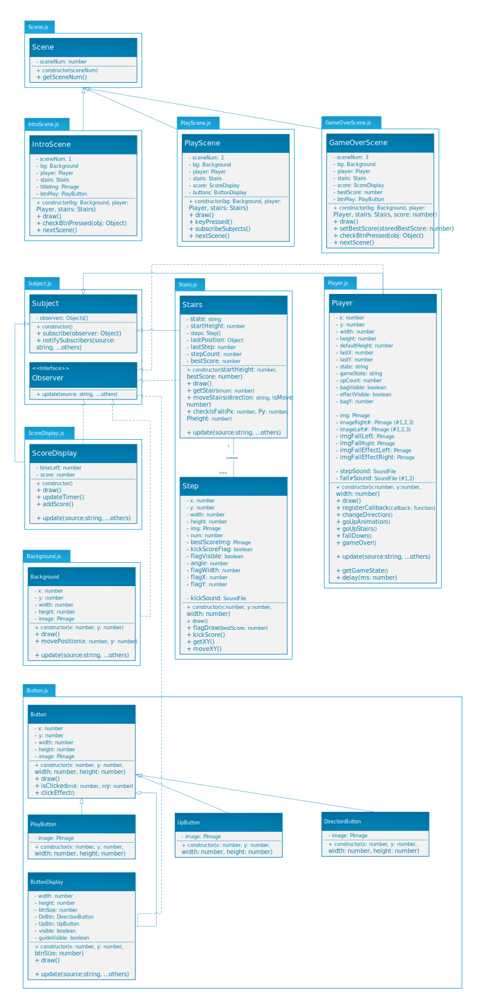

# Project 1 - Software Prototyping ID311

- **Name** : MinheeKim
- **Student ID** : 20190104
- **Repository URL** : [git repository](http://git.prototyping.id/20190104/InfiniteStairs)

## About the game
### **Infinite Stairs**
<p align="center"></p>

**[_Infinite Stairs_](https://play.google.com/store/apps/details?id=com.nflystudio.InfiniteStaircase&hl=ko&gl=US)** is a mobile game developed by NFLY STUDIO that goes up endless stairs. You have to climb the stairs within a shorter and shorter time limit using two buttons: one for change direction and the other for climb stairs.

Once you climb one stair, the time limit is increased, and if you do not climb the next stair within the time limit or fall down the stairs by mistake, the game is over.

The goal of this game is **to climb many stairs and score as much as possible.**

- Scenes of the game
   
   |Intro|Play|GameOver|
   |:---:|:---:|:---:|
   ||||

- Objects of the game

   |Object|Image|Description|
   |:---:|:---:|:---:|
   ||Player|There are many images of different postures of player|
   ||ScoreDisplay|Life gauge is decrease as time goes and increase when the player go upstairs|
   ||Stairs|StairArray is consist of 25 steps|

- Actions and Buttons

   |Button image|Action|User input|
   |:---:|:---:|:---:|
   ||start the game|Mouse click or Space bar |
   ||change direction|Left|
   ||climb one stair|Right|


## Structure of the code
- Design patterns
   - **observer**
      - I used many classes and some of them should listen and act on different objects.
      - |Subject|Observer|
         |---|---|
         |Player|Stairs, ScoreDisplay, ButtonDisplay|
         |Score|Player|
         |Stairs|Player, Background|

   - **state machine**
      - For the transition of the scenes, I used state machine. Every scene object has nextScene() function, and switch the scene when this function is called.
      - 
      - Above images describes the state machine and shared objects. Scenes shares 3 objects and they initialized at game start or restart.

Basically I used vite and p5.js. Also, used **[p5.sound library](https://p5js.org/ko/reference/#/libraries/p5.sound)** for sound effects.

## UML diagram
<p align="center"></p>

[Above](./assets/Images/description/umlDiagram.svg) is UML diagram of this code.


## Challenges
1. Making stairs
   - Stairs should move according to the player's move and also should be created infinitely. (To looks like player goes upstairs, I decided to make stairs goes down.) To match these properties, I used array contains Step objects. I used only 25 step objects and re-positioned steps that has very big y coordinate.
   
   ``` javascript
   // Stairs.js

   // function for making 'num' stairs
   getStairs(num) {
      for (let i=0; i<num; i++) {
         // get top step's position
         const lastX = this.lastPosition.x;
         const lastY = this.lastPosition.y;

         switch (this.state) {
         case 'init':
            stepObj = new Step(X, Y, STEP_WIDTH);
            this.stairArray.push(stepObj);
            this.lastPosition = {x: X, y: Y};         // update lastPosition
            break;
         case 'left':
            ... // calculate x, y
            stepObj = new Step(newX, newY, STEP_WIDTH);
            this.stairArray.push(stepObj);
            this.lastPosition = {x: newX, y: newY};   // update lastPosition
            break;
         case 'right':
            ... // calculate x, y
            stepObj = new Step(newX, newY, STEP_WIDTH);
            this.stairArray.push(stepObj);
            this.lastPosition = {x: newX, y: newY};   // update lastPosition
            break;
         }

         // logic for change step direction
         if (this.stairArray.length == 1) {
         this.state = 'left';    // always start with left step
         } else {
         if (Math.random() > 0.6) {
            this.state == 'left' ? this.state = 'right' : this.state = 'left';
         }}
      }
   }
  
   // move step's position according to player's direction
   moveStairs(direction, isMove) {
      ...

     if (direction == 'L') {        // player: go Left => stairs: go Right
        amountX = STEP_WIDTH;
     } else if (direction == 'R') { // player: go Right => stairs: go Left
        amountX = -STEP_WIDTH;
     }

      // move whole steps
     for (let i=0; i<this.stairArray.length; i++) {
        stepObj = this.stairArray[i];
        stepObj.moveXY(amountX, amountY);
     }

     // if step's y coordinate is so large that invisible in the window,
     // then pop from array and get 1 additional step
     if (this.stairArray[0].getXY().y > height) {
        this.stairArray.splice(0, 1);
        this.lastPosition = this.stairArray.at(-1).getXY();
        this.getStairs(1);
     }
   }
   ```


2. Firebase deploy
   - I tried deploy using firebase, but there was an error on decoding the sound file.
   - In branch 'firebase-deploy'

## References
- [Infinite Stairs-original game](https://play.google.com/store/apps/details?id=com.nflystudio.InfiniteStaircase&hl=ko&gl=US) : All the images I used were taken from this app. (except the background image)